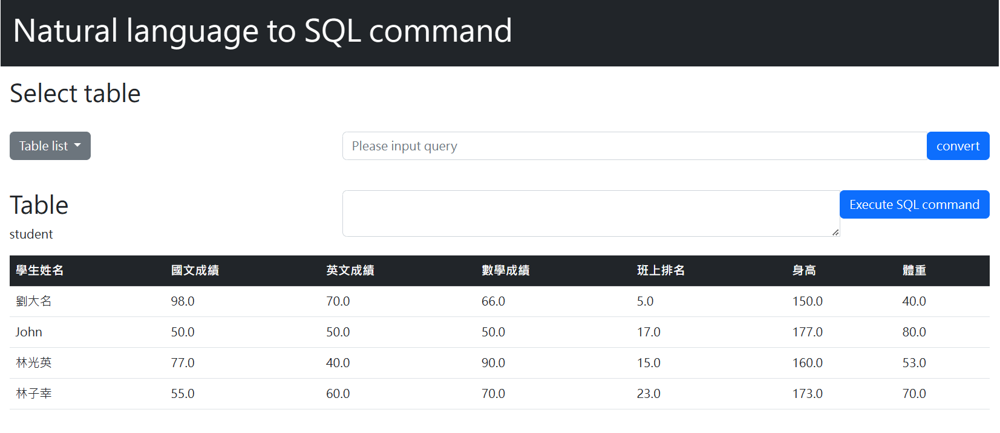
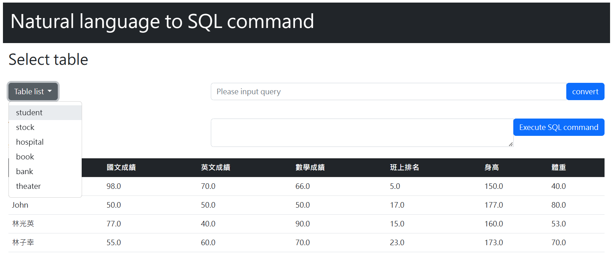
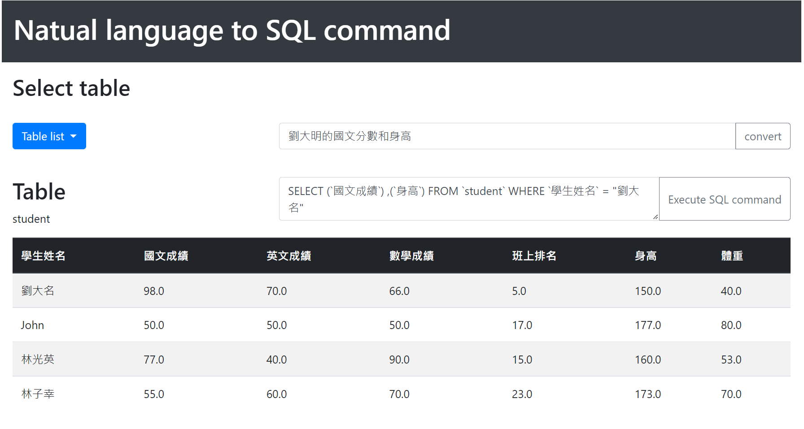
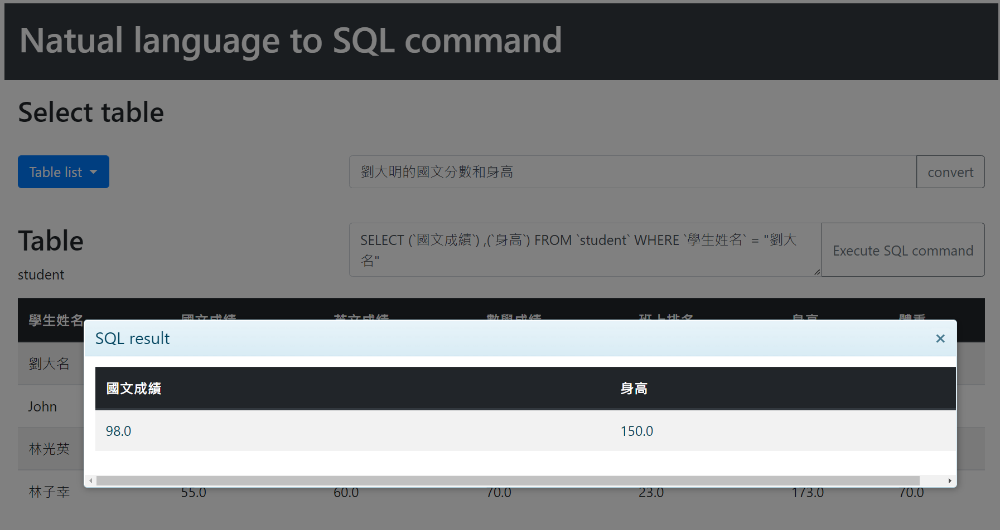

# NL2SQL
NL2SQL is a website that allows users to input natural language and convert them into SQL commands, and you can also execute SQL commands to confirm the results.

# Build up
Download models from [drive](https://drive.google.com/drive/folders/1GC0JHVyxUzjJQrjeL3Fd1H7k9fvcyKjy?usp=sharing) and place it under N2S/saved_models
```
N2S/saved_models
├─M1Model
└─M2Model
```
Build environment
```
docker compose up
```


# Demo
Open http://localhost:5000 to view the main page
--


Select table
--


Enter query and click convert button to get SQL command
--


Execute SQL command
--



