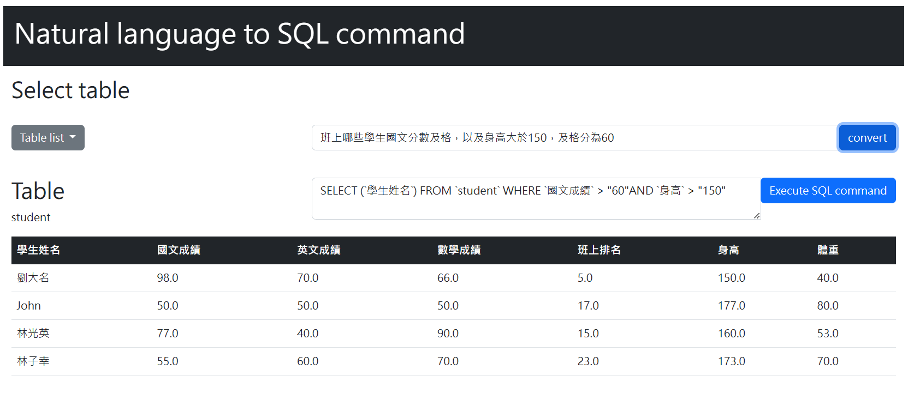
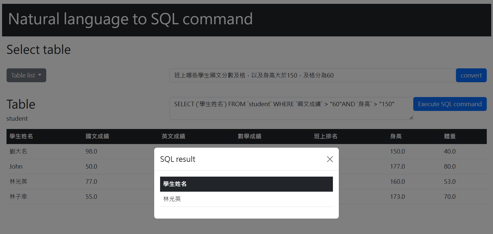

# NL2SQL
NL2SQL is a website that allows users to input natural language and convert them into SQL commands. In addition to generating SQL queries from natural language, the NL2SQL platform also allows users to execute SQL commands directly on the platform to confirm the accuracy of the generated SQL queries.

# Build up
Download models from [drive](https://drive.google.com/drive/folders/1GC0JHVyxUzjJQrjeL3Fd1H7k9fvcyKjy?usp=sharing) and place it under N2S/saved_models
```
N2S/saved_models
├─m1_model
└─m2_model
```
Build environment
```
docker compose up
```


# Demo
Open http://localhost:5000 to view the main page
--


Select table
--


Enter query and click convert button to get SQL command
--


Execute SQL command
--



